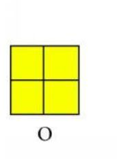
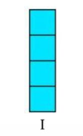
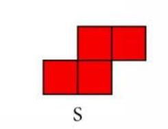
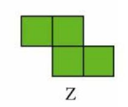
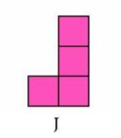
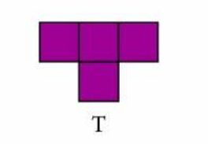
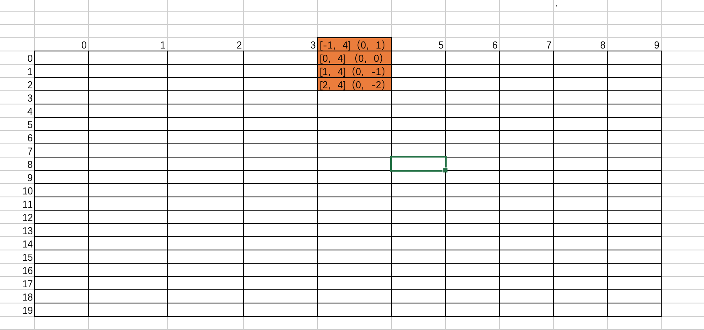

# 俄罗斯方块


***

## 1、基础知识

​        俄罗斯方块原名是俄语Тетрис（英语是Tetris），这个名字来源于希腊语tetra，意思是**“四”**。而游戏的作者最喜欢网球（tennis）。于是，他把两个词tetra和tennis合而为一，命名为Tetris，这也就是俄罗斯方块名字的由来。1984年6月，在俄罗斯科学院计算机中心工作的数学家帕基特诺夫利用空闲时间编出一个游戏程序，用来测试当时一种计算机的性能。帕基特诺夫爱玩拼图，从拼图游戏里得到灵感，设计出了俄罗斯方块。

​        俄罗斯方块是一种常见的休闲类游戏，只要将方块在一行填满就可以消除方块并且获得加分。但是方块就主要7种，其他的都是由着七种方块变化出来的。下面就给大家分别介绍一下这几种方块。    

​    1. "O"形方块是又四个方块组成的一个小正方形，每一是一个对称的图形，可以放在左右两边的位置是最合的。代表的颜色是黄色。



2. "I"形是四个小方块排成一竖排组成的。是所有的7种方块中是最长的一种，只有两种可以改变的形式，就是横过来。代表的颜色是蓝色
   

3. “S”形是四个小方格两两横着相结合，最再将上面的左侧的那个和底下的右侧的那个上下对齐，有四种可以改变的形式。代表的颜色是红色
   

4. “Z”形和"S"形一样，都是上面两个和下面两个正方形，不同的是是上面的右侧正方形和下侧左侧的正方形对齐，和“S”形是镜面对称的，代表的颜色是绿色。
   

5. “L”形是左侧的三个三个小方块竖着摞起来，然后右侧最下面和左侧的对齐，形成的形状特别像英语字母的L。代表的颜色是橙色。
   

6. “J”形和“L”形的形成方式差不多是一样的，也是三个小正方形竖着叠在一起，不过第四个需要加上的小正方形被放到了左边，和“L”也是一个镜面的对称关系。代表颜色是粉色。
   

7. “T”形也是一个轴对称图形，是三个小正方形横着排，并且在中间的那个小正方形下面加了一个小方块组成的。因为组成的形状类似字母“T”。代表的颜色是紫色。
   
   
   

## 2、写一个界面

创建一个525*600大小的游戏界面，这里使用JFrame类实现，窗口设置居中。实现代码如下：

```java
package com.atguigu;


import javax.swing.*;

public class StartGame extends JFrame {

    public static void main(String[] args) {
        JFrame frame = new JFrame();
        frame.setSize(525, 600);
        frame.setUndecorated(false);//true去掉窗口框！
        frame.setTitle("俄罗斯方块");
        frame.setDefaultCloseOperation(JFrame.EXIT_ON_CLOSE);
        //Location 位置 RelativeTo相对于
        frame.setLocationRelativeTo(null);//使当前窗口居中
        frame.setVisible(true);
    }
}
```

运行结果如下：


### 2.1 游戏帮助

帮助按钮，可以查看游戏的规则，如下所示

```java
package com.atguigu.help;
import javax.swing.*;
import javax.swing.event.MenuEvent;
import javax.swing.event.MenuListener;
public class Help extends JDialog {
    //点击帮助按钮显示对话框
    public void showHelp(JFrame frame, JMenu menuFile) {
        menuFile.addMenuListener(new MenuListener() {
            @Override
            public void menuSelected(MenuEvent e) {
                showDialog(frame);
            }
            @Override
            public void menuDeselected(MenuEvent e) {
            }
            @Override
            public void menuCanceled(MenuEvent e) {
            }
        });
    }
    public static void showDialog(JFrame frame) {
        JLabel label = new JLabel();
        label.setText("<HTML>键盘方向←:向左移动;" +
                "<br>键盘方向->:向右移动;" +
                "<br>键盘方向↑:方块旋转;" +
                "<br>键盘方向↓:加速下落" +
                "<br>P:暂停" +
                "<br>Q:退出</HTML>");
        JDialog jDialog = new JDialog(frame);
        jDialog.setSize(200,200);
        jDialog.add(label);
        jDialog.setVisible(true);
        //jDialog相对放在jframe的中间
        jDialog.setLocationRelativeTo(frame);
    }
}
```

在游戏界面main方法中加入帮助按钮，代码如下

```java
//创建并添加菜单栏
 JMenuBar menuBar = new JMenuBar();
 frame.setJMenuBar(menuBar);
 JMenu menuFile = new JMenu("Help(F1)");
 menuBar.add(menuFile);
 //点击帮助按钮显示游戏帮助
 Help help = new Help();
 help.showHelp(frame, menuFile);
```

运行结果如下所示


3、

## 3、定义方块类

如上面的T形图片，由四个一样的小方块组合起来，所以根据面向对象的思想只需要创建一个格子类即可，如下所示


其他形状同理。

### 3.1创建方块类

方块类需要有三个属性，分别是所在横坐标，纵坐标以及所用的图片，如果方块向下移动，则列坐标进行加1操作，向左移动，行坐标进行减1操作，向右移动，行坐标进行加1操作，

```java
package com.atguigu.square;

import java.awt.*;

/**
 * 格子
 * 每一个小方块，就有所在的行 列 和图片
 */
public class Square {
    //方格当前所在行
    private int row;
    //方格当前所在列
    private int col;
    //格子图片颜色
    private Image image;

    public Square() {
    }

    public Square(int row, int col, Image image) {
        super();
        this.row = row;
        this.col = col;
        this.image = image;
    }

    public int getRow() {
        return row;
    }

    public void setRow(int row) {
        this.row = row;
    }

    public int getCol() {
        return col;
    }

    public void setCol(int col) {
        this.col = col;
    }


    public Image getImage() {
        return image;
    }

    public void setImage(Image image) {
        this.image = image;
    }
    /**
     * 方格向右移动
     */
    public void moveRight(){
        col++;
    }

    /**
     * 方格向左移动
     */
    public void moveLeft(){
        col--;
    }
    /**
     * 方格向下移动
     */
    public void moveDown(){
        row++;
    }

    @Override
    public String toString() {
        return "["+row+","+col+"]";
    }
}
```

## 4、加载静态资源

前面图片已经定义好了，需要加载到内存中使用，定义一个静态资源类，如下所示

```java
package com.atguigu.data;

import javax.imageio.ImageIO;
import java.awt.*;

public class Data {
    private static Image background;//背景图片
    public static Image I;
    public static Image J;
    public static Image L;
    public static Image S;
    public static Image Z;
    public static Image O;
    public static Image T;
    static{
        try{
            background = ImageIO.read(
                    Data.class.getResource("image/tetris.png"));
            T=ImageIO.read(Data.class.getResource("image/T.png"));
            I=ImageIO.read(Data.class.getResource("image/I.png"));
            S=ImageIO.read(Data.class.getResource("image/S.png"));
            Z=ImageIO.read(Data.class.getResource("image/Z.png"));
            L=ImageIO.read(Data.class.getResource("image/L.png"));
            J=ImageIO.read(Data.class.getResource("image/J.png"));
            O=ImageIO.read(Data.class.getResource("image/O.png"));
        }catch(Exception e){
            e.printStackTrace();
        }
    }
}
```

## 5、创建对应的不同形状的类

第3步和第4步已经定义好了每个方块的形状和颜色，接下来需要创建出不同的形状类

### 5.1 创建坐标类

每种不同形状的俄罗斯方块都由4个小方块组成，所以共有8个坐标，坐标类定义如下所示。

```java
package com.atguigu.shape;
/**
 * 俄罗斯方块的坐标，每个形状都由4个小方块组成，所以共有8个坐标
 */
public class Coordinate {
    private int row0,col0,row1,col1,row2,col2,row3,col3;

    public Coordinate(int row0, int col0, int row1, int col1,
                      int row2, int col2,
                      int row3, int col3) {
        this.row0 = row0;
        this.col0 = col0;
        this.row1 = row1;
        this.col1 = col1;
        this.row2 = row2;
        this.col2 = col2;
        this.row3 = row3;
        this.col3 = col3;
    }

    public int getRow0() {
        return row0;
    }

    public void setRow0(int row0) {
        this.row0 = row0;
    }

    public int getCol0() {
        return col0;
    }

    public void setCol0(int col0) {
        this.col0 = col0;
    }

    public int getRow1() {
        return row1;
    }

    public void setRow1(int row1) {
        this.row1 = row1;
    }

    public int getCol1() {
        return col1;
    }

    public void setCol1(int col1) {
        this.col1 = col1;
    }

    public int getRow2() {
        return row2;
    }

    public void setRow2(int row2) {
        this.row2 = row2;
    }

    public int getCol2() {
        return col2;
    }

    public void setCol2(int col2) {
        this.col2 = col2;
    }

    public int getRow3() {
        return row3;
    }

    public void setRow3(int row3) {
        this.row3 = row3;
    }

    public int getCol3() {
        return col3;
    }

    public void setCol3(int col3) {
        this.col3 = col3;
    }
}
```

接下来创建不同的形状的类，类名使用俄罗斯方块的形状命名

### 5.2 创建“I”形类

类中定义了两个List，第一个squares用来存储俄罗斯方块的初始化坐标，假如游戏面板定义为10*20的坐标系，那么初始化位置如下所示


第二个coordinateList用来存储多个形状的相对坐标，寻找其中的某一个方块为定点，以该定点为坐标原点进行图形的旋转，注意此时不能再以10*20为坐标系了，

假如我们以上图中的[0,4]为新的坐标原点，坐标变为(0,0)，其他三个坐标分别是(-1,0),(1,0),(2,0)，I形的所有形状总共有2种，分别是竖形和横形，所以应该有2个Coordinate对象，画图如下所示。注意[0,3]是按照行和列来描述的，[-1，0]是按照坐标系来描述的


另一种图形如下所示



可以发现其运算规则为

【-1，4】 = 【0，4】+【-1，0】

【0，4】=【0，4】+【0，0】

【1，4】=【0，4】+【1，0】

【2，4】=【0，4】+【2，0】

正好是squares集合中的坐标原点的行列加上coordinateList集合中的另一个形状的坐标位置，这里很重要，后面旋转图形的时候需要用到。

```java
package com.atguigu.shape;
import com.atguigu.data.Data;
import com.atguigu.square.Square;
import java.util.ArrayList;
import java.util.List;
public class I {
    private List<Square> squares = new ArrayList<Square>();
    private List<Coordinate> coordinateList = new ArrayList<Coordinate>();
    public I() {
        squares.add(new Square(0, 4, Data.I));
        squares.add(new Square(0, 3, Data.I));
        squares.add(new Square(0, 5, Data.I));
        squares.add(new Square(0, 6, Data.I));
        coordinateList.add(new Coordinate(0,0, 0,1, 0,-1, 0,-2));
        coordinateList.add(new Coordinate(0,0, -1,0, 1,0,2,0));
    }
}
```

下面图形的创建也是同理

### 5.3 创建“J”形类

```java
package com.atguigu.shape;
import com.atguigu.data.Data;
import com.atguigu.square.Square;
import java.util.ArrayList;
import java.util.List;

public class J  {
    private List<Square> squares = new ArrayList<Square>();
    private List<Coordinate> coordinateList = new ArrayList<Coordinate>();
    public J() {
        squares.add(new Square(0, 4, Data.J));
        squares.add(new Square(0, 3, Data.J));
        squares.add(new Square(0, 5, Data.J));
        squares.add(new Square(0, 5, Data.J));
        coordinateList.add(new Coordinate(0,0, 0,-1, 0,1, 1,1));
        coordinateList.add(new Coordinate(0,0, -1,0, 1,0, 1,-1));
        coordinateList.add(new Coordinate(0,0, 0,1, 0,-1, -1,-1));
        coordinateList.add(new Coordinate(0,0, 1,0, -1,0, -1,1 ));

    }
}
```

### 5.4 创建“Z”形类

```java
package com.atguigu.shape;

import com.atguigu.data.Data;
import com.atguigu.square.Square;

import java.util.ArrayList;
import java.util.List;


public class Z  {
    private List<Square> squares = new ArrayList<Square>();
    private List<Coordinate> coordinateList = new ArrayList<Coordinate>();
    public Z() {
        squares.add(new Square(1, 4, Data.Z));
        squares.add(new Square(0, 3, Data.Z));
        squares.add(new Square(0, 4, Data.Z));
        squares.add(new Square(1, 5, Data.Z));
        coordinateList.add( new Coordinate(0,0, -1,-1, -1,0, 0,1 ));
        coordinateList.add(new Coordinate(0,0, -1,1, 0,1, 1,0 ));

    }
}

```

### 5.5 创建“L”形类

```java
package com.atguigu.shape;

import com.atguigu.data.Data;
import com.atguigu.square.Square;
import java.util.ArrayList;
import java.util.List;


public class L {
    private List<Square> squares = new ArrayList<Square>();
    private List<Coordinate> coordinateList = new ArrayList<Coordinate>();
    public L() {
        squares.add(new Square(0, 4, Data.L));
        squares.add(new Square(0, 3, Data.L));
        squares.add(new Square(0, 5, Data.L));
        squares.add(new Square(1, 3, Data.L));
        coordinateList.add(new Coordinate(0,0, 0,-1, 0,1, 1,-1 ));
        coordinateList.add(new Coordinate(0,0, -1,0, 1,0, -1,-1));
        coordinateList.add(new Coordinate(0,0, 0,1, 0,-1, -1,1));
        coordinateList.add(new Coordinate(0,0, 1,0, -1,0, 1,1));

    }
}
```

### 5.6 创建“O”形类

```java
package com.atguigu.shape;

import com.atguigu.data.Data;
import com.atguigu.square.Square;
import java.util.ArrayList;
import java.util.List;


public class O {
    private List<Square> squares = new ArrayList<Square>();
    private List<Coordinate> coordinateList = new ArrayList<Coordinate>();
    public O() {
        squares.add(new Square(0, 4, Data.O));
        squares.add(new Square(0, 5, Data.O));
        squares.add(new Square(1, 4, Data.O));
        squares.add(new Square(1, 5, Data.O));
        coordinateList.add(new Coordinate(0,0, 0,1, 1,0, 1,1 ));
    }
}
```

### 5.7 创建“S”形类

```java
package com.atguigu.shape;

import com.atguigu.data.Data;
import com.atguigu.square.Square;
import java.util.ArrayList;
import java.util.List;


public class S {
    private List<Square> squares = new ArrayList<Square>();
    private List<Coordinate> coordinateList = new ArrayList<Coordinate>();
    public S() {
        squares.add(new Square(0, 4, Data.S));
        squares.add(new Square(0, 5, Data.S));
        squares.add(new Square(1, 3, Data.S));
        squares.add(new Square(1, 4, Data.S));
        coordinateList.add( new Coordinate(0,0, 0,1, 1,-1, 1,0 ));
        coordinateList.add( new Coordinate(0,0, -1,0, 1,1, 0,1 ));
    }
}
```

### 5.8 创建“T”形类

```java
package com.atguigu.shape;

import com.atguigu.data.Data;
import com.atguigu.square.Square;
import java.util.ArrayList;
import java.util.List;
public class T {
    private List<Square> squares = new ArrayList<Square>();
    private List<Coordinate> coordinateList = new ArrayList<Coordinate>();
    public T() {
        squares.add(new Square(0, 4, Data.T));
        squares.add(new Square(0, 3, Data.T));
        squares.add(new Square(0, 5, Data.T));
        squares.add(new Square(1, 4, Data.T));
        coordinateList.add(new Coordinate(0,0, 0,-1, 0,1, 1, 0));
        coordinateList.add(new Coordinate(0,0, -1,0, 1,0, 0,-1));
        coordinateList.add(new Coordinate(0,0, 0,1,  0,-1, -1,0));
        coordinateList.add( new Coordinate(0,0, 1,0, -1,0, 0,1));
    }
}
```

### 5.9 俄罗斯方块的各种行为类

该类包含了俄罗斯方块的旋转，移动等方法以及随机生成不同形状的俄罗斯方块方法。因为这里需要返回不同的形状，所以需要让不同形状的类继承该行为类，创建行为类如下

```java
public class Tetromino {
    public static Tetromino randomTetromino(){
        Random r = new Random();
        //随机产生7以内的数字，选择不同的方块形状
        int type = r.nextInt(7);
        switch(type){
        case 0: return new T();
        case 1: return new I();
        case 2: return new J();
        case 3: return new L();
        case 4: return new O();
        case 5: return new S();
        case 6: return new Z();
        }
        return null;
    }
}
```

修改“I”形类如下，其他形状的类同理。

```java
public class I extends Tetromino {
    private List<Square> squares = new ArrayList<Square>();
    private List<Coordinate> coordinateList = new ArrayList<Coordinate>();
    public I() {
        squares.add(new Square(0, 4, Data.I));
        squares.add(new Square(0, 3, Data.I));
        squares.add(new Square(0, 5, Data.I));
        squares.add(new Square(0, 6, Data.I));
        coordinateList.add(new Coordinate(0,0, 0,1, 0,-1, 0,-2));
        coordinateList.add(new Coordinate(0,0, -1,0, 1,0,2,0));
    }
}
```

可以看到每个类当中都有两个list集合，可以直接放到行为类Tetromino中，修改Tetromino类和“I”形类如下所示。

```java
public class Tetromino {
    protected List<Square> squares = new ArrayList<>();
    //保存旋转的相对于轴位置状态 
    protected List<Coordinate> coordinateList = new ArrayList<>();
    public static Tetromino randomTetromino(){
        Random r = new Random();
        //随机产生7以内的数字，选择不同的方块形状
        int type = r.nextInt(7);
        switch(type){
        case 0: return new T();
        case 1: return new I();
        case 2: return new J();
        case 3: return new L();
        case 4: return new O();
        case 5: return new S();
        case 6: return new Z();
        }
        return null;
    }
}
```

“I”形类如下，其他形状类同理

```java
public class I extends Tetromino {
    public I() {
        squares.add(new Square(0, 4, Data.I));
        squares.add(new Square(0, 3, Data.I));
        squares.add(new Square(0, 5, Data.I));
        squares.add(new Square(0, 6, Data.I));
        coordinateList.add(new Coordinate(0,0, 0,1, 0,-1, 0,-2));
        coordinateList.add(new Coordinate(0,0, -1,0, 1,0,2,0));
    }
}
```

因为在square类中定义了每个小方块的移动方法，这里需要重新定义一个整体的俄罗斯方块的移动方法，在Tetromino类中添加如下方法

```java
    /** 下落 */
    public void slowDrop(){
        for(int i = 0; i< squares.size(); i++){
            squares.get(i).moveDown();
        }
    }

    /**
     * 右移
     */
    public void moveRight(){
        for(int i = 0; i< squares.size(); i++){
            this.squares.get(i).moveRight();
        }
    }

    /**
     * 左移
     */
    public void moveLeft(){
        for(int i = 0; i< squares.size(); i++){
            squares.get(i).moveLeft();
        }
    }
```

除了左右移动之外，俄罗斯方块还需要旋转变化不同的形状，其实只需要在coordinateList列表中获取某一个元素即可，其中T形图形最多有4种形态，所以定义一个变量index，每次旋转对index进行加1操作，然后对coordinateList的长度进行取余运算，之后设置squares集合中的第一个元素为坐标原点，获取其本来的行和列，用来计算旋转之后的图形中的各个小方块的行和列，具体的运算规则前面我们已经讲过了，代码实现如下所示

```java
private int index = 4;
    /** 在 Tetromino 上添加方法  */
    public void rotate() {
        index++;
        reLocation();
    }
    /**
     * 重新定位坐标
     */
    private void reLocation() {
        // index % states.length = 5 % 4 = 1
        Coordinate coordinate = coordinateList.get(index % coordinateList.size());
        // [0] + s1 = [1]
        Square o = squares.get(0);//获取当前的轴
        //轴与相对位置的和作为旋转以后的格子位置
        squares.get(1).setRow(o.getRow() + coordinate.getRow1());
        squares.get(1).setCol(o.getCol() + coordinate.getCol1());
        squares.get(2).setRow(o.getRow() + coordinate.getRow2());
        squares.get(2).setCol(o.getCol() + coordinate.getCol2());
        squares.get(3).setRow(o.getRow() + coordinate.getRow3());
        squares.get(3).setCol(o.getCol() + coordinate.getCol3());
    }
```

这里还需要考虑到一种情形就是，当方块到边界的时候，是不可以翻转的，比如T形图在边界如果正好是下图这样


此时是不可以旋转的，这时候就需要先翻转，然后再翻转回来，其实只需要对index值进行减1操作，再重新设置行和列就可以，在程序计算的时候就好像没有翻转一样，方法如下

```java
public void rotateLeft() {
        index--;
        Coordinate coordinate = coordinateList.get(index%coordinateList.size());
        Square o = squares.get(0);//获取当前的轴
        squares.get(1).setRow(o.getRow() + coordinate.getRow1());
        squares.get(1).setCol(o.getCol() + coordinate.getCol1());
        squares.get(2).setRow(o.getRow() + coordinate.getRow2());
        squares.get(2).setCol(o.getCol() + coordinate.getCol2());
        squares.get(3).setRow(o.getRow() + coordinate.getRow3());
        squares.get(3).setCol(o.getCol() + coordinate.getCol3());
    }
```

## 6. 游戏主面板类

前面根据面向对象的思想已经整合了很多类，下面最主要的就是创建游戏面板了，游戏面板中，包含如下功能

1、绘制当前的俄罗斯方块图形，准备下一个俄罗斯方块图形

2、积分展示，消除的行数展示，功能按钮，比如暂停游戏，继续游戏，退出游戏

3、根据键盘方向键控制俄罗斯方块的移动以及翻转，边界翻转的判断

4、当某行被方块填充无空缺时，消除该行

5、手动按F1显示游戏帮助

6、游戏结束提示按钮

下面开始实现上面的功能

### 1、游戏面板

首先创建一个游戏面板继承JPanel类，为了添加到frame类中，定义构造方法如下

```java
public class GamePanel extends JPanel {
    JFrame frame;
    public GamePanel(JFrame frame) {
        this.frame = frame;
    }
}
```

### 2、绘制游戏面板和俄罗斯方块

paint方法由系统自动调用，绘制一个10*20的网格，

```java
/** 正在下落方块 */
    private Tetromino tetromino;
    /** 下一个下落方块 */
    private Tetromino nextOne;
    /** 行数 */
    public static final int ROWS = 20;
    /** 列数 */
    public static final int COLS = 10;
    /** 墙,整个游戏画布是10*20的大小  宽是10  高是20 主要用来绘制落下的俄罗斯方块组成的图形，如果某个元素为null，表示该行没有填充完整，即不能消除该行*/
    private Square[][] wall = new Square[ROWS][COLS];
    public void action(){
        startAction();
        repaint();
        this.requestFocus();
    }
    /** Tetris 类中添加的方法, 用于启动游戏 */
    public void startAction(){
        //每次启动游戏都清空
        clearWall();
        //随机生成方块
        tetromino = Tetromino.randomTetromino();
        //随机生成下一个方块
        nextOne = Tetromino.randomTetromino();
    }
    private void clearWall(){
        //将墙的每一行的每个格子清理为null
        for(int row=0; row<ROWS; row++){
            Arrays.fill(wall[row], null);
        }
    @Override
    public void paint(Graphics g){
        g.drawImage(Data.background, 0, 0, null);
        g.translate(15, 15);//平移绘图坐标系
        paintTetromino(g);//绘制正在下落的方块
        paintNextOne(g);
    }
    //绘制俄罗斯方块
    private void paintTetromino(Graphics g) {
        List<Square> squares = tetromino.getSquares();
        for(int i = 0; i< squares.size(); i++){
            Square c = squares.get(i);
            int x = c.getCol() * CELL_SIZE-1;
            int y = c.getRow() * CELL_SIZE-1;
            g.drawImage(c.getImage(), x, y, null);
        }
    }
    //绘制下一个俄罗斯方块
    private void paintNextOne(Graphics g) {
        List<Square> squares = nextOne.getSquares();
        for(int i = 0; i< squares.size(); i++){
            Square c = squares.get(i);
            int x = (c.getCol()+10) * CELL_SIZE-1;
            int y = (c.getRow()+1) * CELL_SIZE-1;
            g.drawImage(c.getImage(), x, y, null);
        }
    }
    }
```

在Tetromino类中需要加入以下方法，绘制图形的时候需要俄罗斯方块中的所有小方块的行和列的位置

```java
public List<Square> getSquares() {
        return squares;
    }
```

通过在游戏入口StartGame类中修改main方法来创建游戏面板，代码如下

```java
public static void main(String[] args) {
        JFrame frame = new JFrame();
        frame.setSize(525, 600);
        frame.setUndecorated(false);//true去掉窗口框！
        frame.setTitle("俄罗斯方块");
        frame.setDefaultCloseOperation(JFrame.EXIT_ON_CLOSE);
        //Location 位置 RelativeTo相对于
        frame.setLocationRelativeTo(null);//使当前窗口居中
        //创建并添加菜单栏
        JMenuBar menuBar = new JMenuBar();
        frame.setJMenuBar(menuBar);
        JMenu menuFile = new JMenu("Help(F1)");
        menuBar.add(menuFile);
        //点击帮助按钮显示游戏帮助
        Help help = new Help();
        help.showHelp(frame, menuFile);
        //添加游戏主界面
        GamePanel gamePanel = new GamePanel(frame);
        frame.add(gamePanel);
        frame.setSize(525, 600);
        frame.setUndecorated(false);//true去掉窗口框！
        frame.setTitle("俄罗斯方块");
        frame.setDefaultCloseOperation(JFrame.EXIT_ON_CLOSE);
        frame.setVisible(true);
        gamePanel.action();
    }
```

 运行结果如下


### 3、绘制消除的行数和积分文字展示

代码如下所示

```java
public static final int FONT_COLOR = 0x667799;
    public static final int FONT_SIZE = 0x20;
    /** 分数 */
    private int score;
    /** 消掉的行数 */
    private int lines;
    private boolean pause;
    private boolean gameOver;
    /**
     * 绘制分数
     * @param g
     */
    private void paintScore(Graphics g) {
        Font f = getFont();//获取当前的 面板默认字体
        Font font = new Font(
                f.getName(), Font.BOLD, FONT_SIZE);
        int x = 290;
        int y = 162;
        g.setColor(new Color(FONT_COLOR));
        g.setFont(font);
        String str = "SCORE:"+this.score;
        g.drawString(str, x, y);
        y+=56;
        str = "LINES:"+this.lines;
        g.drawString(str, x, y);
        y+=56;
        str = "[P]Pause";
        if(pause){str = "[C]Continue";}
        if(gameOver){    str = "[S]Start!";}
        g.drawString(str, x, y);
    }
```

在pait方法中调用该方法，如下所示

```java
@Override
    public void paint(Graphics g){
        g.drawImage(background, 0, 0, null);
        g.translate(15, 15);//平移绘图坐标系
        paintTetromino(g);//绘制正在下落的方块
        paintWall(g);//画墙
        paintNextOne(g);
        paintScore(g);
    }
```

运行结果如下。


### 4、让俄罗斯方块可以动起来

包括左右移动，缓慢下落和快速下落

首先创建事件监听，修改action()方法如下

```java
public void action(){
        startAction();
        repaint();
        KeyAdapter l = new KeyAdapter() {
            public void keyPressed(KeyEvent e) {
                int key = e.getKeyCode();
                //按键盘F1显示帮助
                if(key == KeyEvent.VK_F1){
                    Help.showDialog(frame);
                }
                //按键盘Q退出游戏
                if(key == KeyEvent.VK_Q){
                    System.exit(0);//退出当前的Java进程
                }
                //如果游戏结束，按S重新开始
                if(gameOver){
                    if(key==KeyEvent.VK_S){
                        startAction();
                    }
                    return;
                }
                //如果暂停并且按键是[C]就继续动作
                if(pause){//pause = false
                    if(key==KeyEvent.VK_C){    continueAction();    }
                    return;
                }
                //否则处理其它按键
                switch(key){
                    case KeyEvent.VK_RIGHT: moveRightAction(); break;
                    case KeyEvent.VK_LEFT: moveLeftAction(); break;
                    case KeyEvent.VK_DOWN: quickDown() ; break;
                    case KeyEvent.VK_UP: rotateAction() ; break;
                    case KeyEvent.VK_P: pauseAction() ; break;
                }
                repaint();
            }
        };
        this.requestFocus();
        this.addKeyListener(l);
    }
```

此时项目会报错，只需要把对应的方法创建出来即可后面填充该功能

```java
/**
     * 继续游戏
     */
    public void continueAction(){

    }
    /**
     * 快速下落
     */
    public void quickDown(){

    }
    /**
     * 暂停游戏
     */
    public void pauseAction(){

    }
```

此时俄罗斯方块已经可以左右移动了，如下所示


### 5、俄罗斯方块下落

接下来需要让俄罗斯方块自动缓慢下落，需要用到一个定时器Timer类，当手动按向下的方向键时快速下落

下落的时候需要判断是否还可以继续下落，如果碰到底部或者接触到已经下落的方块时则不能继续下落，代码如下

```java
/**
     * 缓慢下落
     * 完成功能：如果能够下落就下落，否则就落地即可，
     * 新的方块出现并开始落下。
     */
    public void slowDropAction(){
        //如果可以下落，则继续下落
        if(tetrominoCanDrop()){
            tetromino.slowDrop();
            return;
        }
        //不能下落的时候表示到底部或者碰到了已经存在的方块了，需要把当前的方块也放到wall数组中去。
        tetrominoLandToWall();
        //消除当前已经满的行
        destroyLines();//消除满的行
        //判断游戏是否结束
        isGameOver();
        //把下一个俄罗斯方块置为当前的方块
        tetromino = nextOne;
        //随机生成下一个方块
        nextOne = Tetromino.randomTetromino();
    }
```

使用定时器自动调用该方法，startAction方法修改如下

```java
public void startAction(){
        //每次启动游戏都清空
        clearWall();
        //随机生成方块
        tetromino = Tetromino.randomTetromino();
        //随机生成下一个方块
        nextOne = Tetromino.randomTetromino();
        //行数
        lines = 0;
        //分数
        score = 0;
        //暂停键  默认是false，表示不暂停
        pause=false;
        //游戏是否结束，默认不结束
        gameOver=false;
        //计时器
        timer = new Timer();
        //定时任务，延迟500毫秒后，执行第一次task，然后每隔500毫秒执行一次task
        timer.schedule(new TimerTask(){
            public void run() {
                slowDropAction();
                repaint();
            }
        }, 500, 500);
    }
```

tetrominoCanDrop()方法用来判断是否可以继续下落，实现如下

```java
/** 检查当前的4格方块能否继续下落 */
    public boolean tetrominoCanDrop(){
        List<Square> squares = tetromino.getSquares();
        for(int i = 0; i< squares.size(); i++){
            Square square = squares.get(i);
            int row = square.getRow(); int col = square.getCol();
            //第一个条件判断是否触底
            // 第二个条件判断，是否正下方的第一个方格是否已经存在数组wall中
            // 若存在，表示已经有方块了，则不能继续下落
            if(row == ROWS-1 || wall[row+1][col] != null){
                return false;
            }
        }
        return true;
    }
```

tetrominoLandToWall()方法实现如下，用来把下落的方块放到wall数组中

```java
public void tetrominoLandToWall(){
        List<Square> squares = tetromino.getSquares();
        for(int i = 0; i< squares.size(); i++){
            Square square = squares.get(i);
            int row = square.getRow();
            int col = square.getCol();
            wall[row][col] = square;
        }
    }
```

paintWall方法用来绘制下落的方块组成的图形，俄罗斯方块下落后也要组成新的图形

```java
//绘制落下的俄罗斯方块组成的图形
    private void paintWall(Graphics g){
        for(int row=0; row<wall.length; row++){
            //迭代每一行, i = 0 1 2 ... 19
            Square[] line = wall[row];
            //line.length = 10
            for(int col=0; col<line.length; col++){
                Square square = line[col];
                int x = col*CELL_SIZE;
                int y = row*CELL_SIZE;
                if(square ==null){
                }else{
                    g.drawImage(square.getImage(), x-1, y-1, null);
                }
            }
        }
    }
```

下面的方法用来消除一个满行

```java
/** 销毁已经满的行，并且计分
     * 1）迭代每一行
     * 2）如果（检查）某行满是格子了 就销毁这行
     **/
    public void destroyLines(){
        int lines = 0;
        for(int row = 0; row<wall.length; row++){
            if(fullSquares(row)){
                deleteRow(row);
                lines++;
            }
        }
        this.lines += lines;
        this.score += SCORE_TABLE[lines];
    }
    private static final int[] SCORE_TABLE={0,1,10,30,200};

    public boolean fullSquares(int row){
        Square[] line = wall[row];
        for(int i=0; i<line.length; i++){
            if(line[i]==null){//如果有空格式就不是满行
                return false;
            }
        }
        return true;
    }
    public void deleteRow(int row){
        for(int i=row; i>=1; i--){
            //复制 [i-1] -> [i]
            System.arraycopy(wall[i-1], 0, wall[i], 0, COLS);
        }
        Arrays.fill(wall[0], null);
    }

```

到此游戏结束


